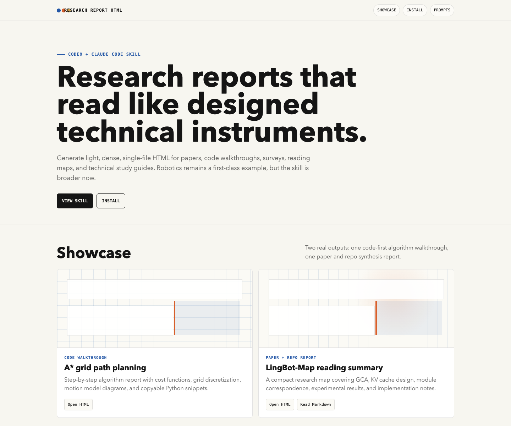

# Research Report HTML

把论文笔记、代码研读、survey、reading list、技术报告生成高级浅色单文件 HTML。

这个仓库发布的是 `research-report-html` skill，可用于 Codex 和 Claude Code。它来自原来的 robotics 风格 HTML skill，但现在主定位已经泛化为“科研报告 HTML 生成”：机器人、具身智能、3D vision 仍然是强场景，但不再局限于 robotics。

## 它适合生成什么

- 论文解读 / paper reading map
- 代码逐行研读 / code walkthrough
- 技术报告 / repo notes / study guide
- research survey / landmark paper timeline
- 带 citation、代码块、表格、模块映射、实验结论的长文档

默认视觉是研究者阅读页：暖白纸面、白色报告卡片、细灰线、克制蓝色 accent、紧凑 reading map、可复制代码块、桌面和移动端都能读。

它不适合：营销 landing page、暗黑电影感产品页、Claude cream/terracotta editorial 风格、纯装饰型网页。

## 示例

| 示例 | 展示点 |
| --- | --- |
| [A* 网格路径规划逐行解读](https://kbfx1234.github.io/research-report-html/examples/a-star-path-planning/a_star_explained.html) | 算法代码 walkthrough、公式、路径规划图、PrismJS 代码复制按钮。 |
| [LingBot-Map 论文与代码研读](https://kbfx1234.github.io/research-report-html/examples/lingbot-map/LINGBOT_MAP_PAPER_CODE_SUMMARY.html) | 论文 + repo synthesis、模块映射、创新点、benchmark 表格、实现 caveat。 |

预览图：



也可以直接打开线上 showcase：[kbfx1234.github.io/research-report-html](https://kbfx1234.github.io/research-report-html/)，或查看仓库里的 [index.html](index.html)。

## 安装到 Codex

在 Codex 里直接说：

```text
$skill-installer install https://github.com/kbfx1234/research-report-html/tree/main/skills/research-report-html
```

如果安装后没有立刻出现，重启 Codex。

也可以用可审计的本地安装：

```bash
git clone https://github.com/kbfx1234/research-report-html.git
cd research-report-html
bash scripts/install.sh --target codex
```

## 安装到 Claude Code

Claude Code 的个人 skill 目录是 `~/.claude/skills/<skill-name>/SKILL.md`：

```bash
git clone https://github.com/kbfx1234/research-report-html.git
mkdir -p ~/.claude/skills
cp -R research-report-html/skills/research-report-html ~/.claude/skills/
```

也可以让 Claude Code 自己安装：

```text
Clone https://github.com/kbfx1234/research-report-html and install the skill folder at skills/research-report-html into ~/.claude/skills/research-report-html. Then verify that /research-report-html is available.
```

## 通用安装脚本

默认同时安装到 Codex 和 Claude Code：

```bash
git clone https://github.com/kbfx1234/research-report-html.git
cd research-report-html
bash scripts/install.sh
```

只安装一个目标：

```bash
bash scripts/install.sh --target codex
bash scripts/install.sh --target claude
```

覆盖更新已有安装：

```bash
bash scripts/install.sh --target both --force
```

## 可直接使用的 Prompt

```text
Use research-report-html to turn this Markdown paper summary into a compact HTML reading map with implementation caveats and benchmark tables.
```

```text
Generate a single-file HTML code walkthrough for this path-planning module. Explain the main loop, data structures, edge cases, and final path reconstruction.
```

```text
Create a research survey HTML page from these paper notes. Use a chronological timeline, contribution taxonomy, and visible paper links.
```

```text
Make a polished technical report HTML for this repo README and architecture notes. Include a module map, data flow, risks, and reproduction checklist.
```

```text
Build a robotics research report page from this paper and code summary. Keep it light, dense, and researcher-facing, not a product homepage.
```

## 验证

```bash
python3 scripts/validate_repo.py
```

验证脚本会检查仓库结构、skill frontmatter、HTML 完整性、外链白名单、本机路径泄漏和安装脚本模拟。

## License

MIT. See [LICENSE](LICENSE).
